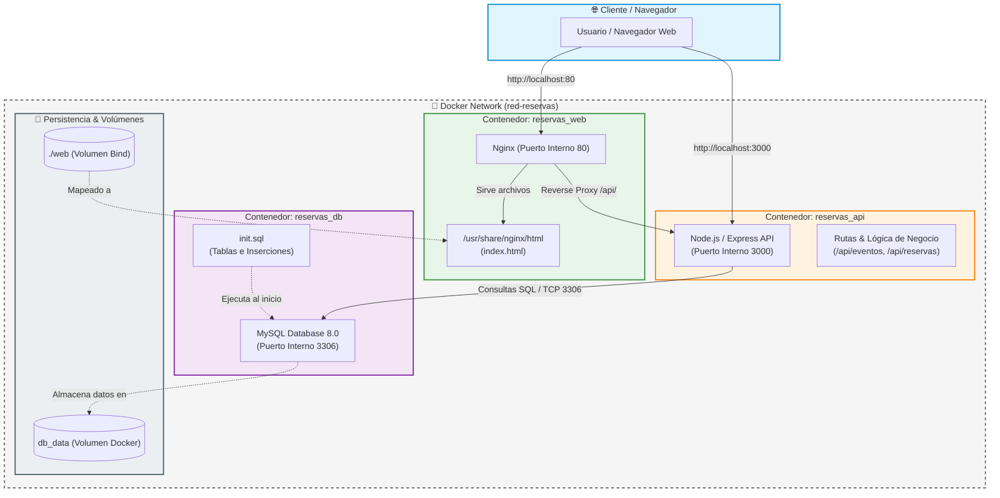

# Plataforma de Reservas Culturales de Sevilla

Solución de despliegue en contenedores Docker para la gestión de reservas culturales.
- **Diagrama de arquitectura**
- ## Arquitectura del Sistema

## Estructura y Arquitectura
- **Nginx (Web/Proxy):** Expuesto al puerto `80`.
- **API (Node.js):** Puerto interno `3000` (sin exponer al host).
- **Base de Datos (MySQL 8.0):** Puerto interno `3306` (sin exponer al host) con persistencia de datos.

## Despliegue Rápido
1. Copia de credenciales: `cp .env.example .env`
2. Construir y arrancar: `docker compose up --build -d`

## Pruebas de Verificación
- **Estado de contenedores:** `docker compose ps`
- **Prueba API Health:** `curl -i http://localhost/api/health`
- **Prueba Base de Datos:** `curl -i http://localhost/api/reservas`

## Prueba de Persistencia de Datos
1. `docker compose stop db && docker compose rm -f db`
2. `docker compose up -d db`
3. `curl -i http://localhost/api/reservas` (los datos siguen existiendo).
